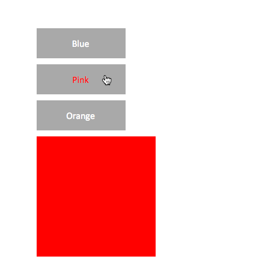
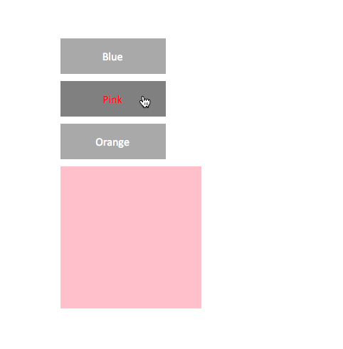
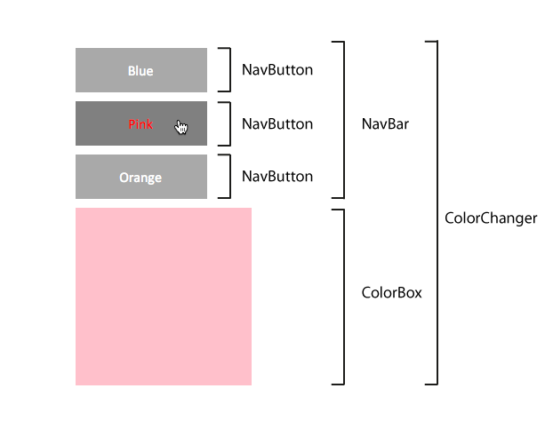

Basic Navigation Bar Menu System in Elm
=======================================

This is a demonstration of a basic navigation system created with Elm.
It's useful because it shows how a parent module can share information with
its nested child module, and also how sibling modules can communicate
back and forth. This essential system can be used as the basis for
building all kinds of menu bars or navigation systems for websites or
apps. It's based on the [Elm Architecture](https://github.com/evancz/elm-architecture-tutorial/) using techniques no more
advanced than [Example #4: A Fancier List of Counters](https://github.com/evancz/elm-architecture-tutorial/). If you're new
to Elm, I recommend that you carefully work through and understand the first
4 Elm Architecture examples before approaching the code in this
repository.

What it does
------------

Run `Main.elm` and you'll see 3 buttons, each labeled with the name
of a different color. When the mouse moves over a button, the button
label changes to red. When the mouse moves out, the label changes back to
white.



The mouse pointer also changes to a hand icon when it's over a button.

When you click on a button, the button color darkens and the big
square below the list of buttons changes to the same color as the button label.



The selected button will stay selected until you click another button.

In most other programming languages, building a navigation menu bar like this 
usually involves a lot of tricky state management and is highly bug-prone. But, as you'll see ahead, thanks 
to Elm's immutable data structures and pristine module encapsulation,
button states practically manage themselves. 

How the code is structured
--------------------------

Each button is made from a module called `NavButton`. The buttons are nested
inside a parent module called `NavBar`, which creates the list of buttons.
The main program is a module called `ColorChanger`, which imports the
`NavBar` and `ColorBox`. The `ColorBox` is just the big square which
changes color when any of the buttons are clicked.



`ColorChanger` is the top-level module. Its job is to find out from
the `NavBar` what the currently selected button is, and then change
the color of the `ColorBox` to match that color.

It's the job of the `NavBar` to track which button has been selected,
and to tell that button to switch to its selected state. It's this
interesting back-and-forth communication between parent and child
modules which is very useful pattern to know for building menu systems
for all kinds of applications.

Using a Context for the NavButton actions
-----------------------------------------

The `NavButton` is the lowest level building block. Its `update` function 
is a very simple state machine that describes all the possible actions 
that a button can have.

```elm
type Action 
  = Over 
  | Out
  | Select
  | Deselect

update : Action -> Model -> Model
update action model = 
  case action of
    Over -> 
      { model | textColor = "red" }

    Out ->
      { model | textColor = "white" }

    Select ->
      { model
          | backgroundColor = "grey" 
          , selected = True
      }

    Deselect ->
      { model
          | backgroundColor = "darkGrey" 
          , selected = False
      }


```
If you've read through the Elm Architecture, you'll immediately
recognize this pattern.

The button's `Over` and `Out` hover states can be handled internally
by the `NavButton` module itself. However (and very importantly!), we want the `Select` and `Deselect`
actions **to be handled by the parent `NavBar` module**.

How can we do this? By creating a **Context** which allows the
selection actions to be handled by the parent module. Here's the
`Context` in the `NavButton` that sets this up.
```elm
type alias Context = 
  { actions : Signal.Address Action
  , select : Signal.Address ()
  }
```
`actions` will be directed internally to this `NavButton` module, and
`select` will be directed to the external parent module. We don't need to know
what the parent module is - this will work no matter what other module
`NavButton` is imported into. 

Here's the code in the `NavButton`'s `view` that uses the Context to set this up.
```elm
view : Context -> Model -> Html
view context model =
  li 
    [ navButtonStyle model
    , onMouseEnter context.actions Over
    , onMouseLeave context.actions Out
    , onClick context.select ()
    ] 
    [ text model.content ]
```
You can see that the `onClick` event is directed to `context.select`.

Now the next step is to set up the parent module to handle the
`context.select` action.

Selecting a button
------------------

The `NavBar` module imports the `NavButton` module. Its `Model`
record is very simple: a list of buttons, and `selectedButton`
property that is used to track the currently selected button.
```elm
type alias Model = 
  { buttons : List NavButton.Model 
  , selectedButton : String
  } 

model : Model
model = 
  { buttons = [] 
  , selectedButton = ""
  }
```
It has an `initialize` function that takes a list of button label
names, and uses them to create a list of buttons. If you give it 10
names, you'll end up with 10 buttons. (The example in this repository
just uses a list of three names: "Blue", "Pink" and "Orange")

```elm
initialize : List String -> Model
initialize names =
  let createButtons names =
    List.map (\button -> NavButton.initialize button) names
  in
    { model | buttons = createButtons names }
```
The structure of the `NavBar` module is otherwise very similar to the
`CounterList` module in Example 4 of the Elm Architecture. The
`viewButton` function uses the `NavButton.Context` to determine which
modules should handle which actions.
```elm
viewButton : Signal.Address Action -> ID -> NavButton.Model -> Html
viewButton address id model =
  let context =
      NavButton.Context
        (Signal.forwardTo address (Hover id))
        (Signal.forwardTo address (always (Select model)))
  in
    NavButton.view context model
```
The `Hover` action (which sets the buttons `Over` and `Out` states) 
will be handled by the child `NavButton` module. But the `Select` action
will be handled by the `NavBar` module itself. We want the `NavBar` module to
handle it so that it can track which button has currently been
selected. Here's the `Select` action code from the `NavBar`'s `update`
function that does this.
```elm
Select selectedButtonModel ->

  let

    -- `updateButton` checks whether a button has the same
    -- content string as the selected button. If it does, it
    -- updates the model and sets its action to `Select`.
    -- If it doesn't, it sets the button's action to `Deselect`
    -- (See the `NavButton` module for details on how this works.)

    updateButton buttonModel =
      if buttonModel.content == selectedButtonModel.content
         then
           NavButton.update NavButton.Select buttonModel
         else
           NavButton.update NavButton.Deselect buttonModel

  in

  -- Set the name of the currently clicked-on button as the
  -- model's `selectedButton` and update the buttons to reflect
  -- their selection state.

  { model 
      | selectedButton = selectedButtonModel.content
      , buttons = List.map updateButton model.buttons
  }

```
Here's how this works:

`Select` takes the currently clicked `NavButton` model as an argument,
and sets the `NavBar`'s `selectedButton` property to the same value as
the selected button's content. (This will be either "Blue", "Pink" or
"Orange" in this example.) The `NavBar`'s `buttons` list is then
updated by checking whether any button in the list has the same
`content` as the selected button that was passed into the `Select`
action. If it does, then that button's `update` function is called with
the value `Select`. If it doesn't, the button's update function is
called with the value `Deselect`. `Select` and `Deselect` are actions
in the `NavButton` module which will change the button's background
color.

This is how the navigation bar maintains the correct button selection
state, but how does it actually change the color of the big square in
the main application?

Changing the color of the `ColorBox`
-----------------------------------

The `ColorBox` is the big square at the bottom of the navigation bar
that changes color when the buttons are pressed. It has a very simple
model:
```elm
model = 
  { color = "red"
  , width = 200
  , height = 200
  }
```
It also has a function called `changeColor` that returns a new model
with a different color.
```elm
changeColor : String -> Model
changeColor newColor =
  { model | color = newColor }
```
Both this `ColorBox` module and the `NavBar` module are imported into
a new parent module called `ColorChanger` which is actually the main
application that puts everything together. The `ColorChanger` model is a record which initializes a new
`NavBar` with a list of the button names you want to use. It also has a `ColorBox` model. 
```elm
type alias Model =
  { navigationBar : NavBar.Model
  , colorBox : ColorBox.Model
  }

model : Model
model = 
  { navigationBar = NavBar.initialize ["Blue", "Pink", "Orange"]
  , colorBox = ColorBox.model
  }
```
Its `view` is typical of any ordinary Elm Architecture view pattern.
It directs the `NavBar` to handle its own actions, and simply displays
the `ColorBox` (which has no actions.)
```elm
view : Signal.Address Action -> Model -> Html
view address model =
  div []
    [ NavBar.view (Signal.forwardTo address UpdateNavigation) model.navigationBar
    , ColorBox.view model.colorBox
    ]
```
The `ColorChanger`'s `update` function first updates the navigation
bar with a `newNavBar`. This is important so that the correct, current
button states are properly displayed. Next, it uses the `ColorBox`'s `changeColor` function
to get a new `colorBox` which is the same color as whatever the `newNavBar`'s current
`selectedButton` is.

```elm
type Action = UpdateNavigation NavBar.Action 

update : Action -> Model -> Model
update action model =
  case action of
    UpdateNavigation action ->
      let
        
        -- Get a new updated version of the navigation bar

        newNavBar = NavBar.update action model.navigationBar

        -- Get the color of the NavBar's selected button

        getColor selectedButton =
          if selectedButton /= "" 
             then 
               ColorBox.changeColor selectedButton
             else 
               model.colorBox

      in

      -- Update the model with the new navigation bar and set the
      -- `colorBox` to the color of the new navigation bar's
      -- `selectedButton` 

      { model
          | navigationBar = newNavBar
          , colorBox = getColor newNavBar.selectedButton
      }
```
And that's it!

Why it's cool
-------------

A few reasons:

- The buttons manage their internal state, and don't need to know
    anything about the state of the other buttons in the navigation
    bar. They don't need to know whether they've been selected or
    deselected.
- The navigation bar just decides which buttons should be selected or deselected, and
    the buttons figure out for themselves how they should behave in
    those states.
- The color box doesn't need to know anything about the state of the
    buttons - it just cares about whatever the navigation bar's
    currently selected button is.

Building navigation bar menu systems like this
tends to be one of the most tedious and usually bug-prone aspects of
application design. That's because of all the tricky state management you have to
be careful of. But thanks to Elm and the Elm Architecture, modules can
manage their own internal states and remain completely encapsulated
from the rest of the system. And, best of all: you can scale this same basic system
to any size without having to do any more work, and be guaranteed the same
bug-free performance. Yay, Elm!


